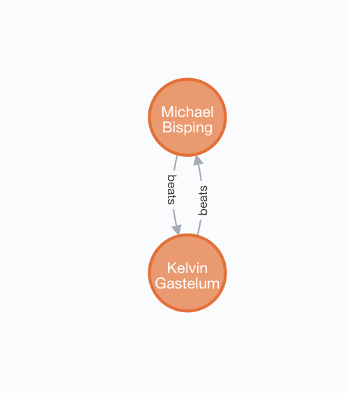

## Exercise 1

- Khabib Nurmagomedov(155) > Rafael Dos Anjos (155)
- Rafael Dos Anjos > Neil Magny(170)
- Jon Jones(205) > Daniel Cormier(205)
- Michael Bisping (185)> Matt Hamill (185)
- Jon Jones > Brandon Vera (205)
- Brandon Vera > Frank Mir (230)
- Frank Mir > Brock Lesnar(230)
- Neil Magny > Kelvin Gastelum(185)
- Kelvin Gastelum > Michael Bisping
- Michael Bisping > Matt Hamill
- Michael Bisping > Kelvin Gastelum
- Matt Hamill > Jon Jones

```
CREATE
(f1:Fighter {name: 'Khabib Nurmagomedov', weight: 155})-[:beats]->(f2:Fighter {name: 'Rafael Dos Anjos', weight: 155}),
(f2)-[:beats]->(f3:Fighter {name: 'Neil Magny', weight: 170}),
(f4:Fighter {name: 'Jon Jones', weight: 205})-[:beats]->(f5:Fighter {name: 'Daniel Cormier', weight: 205}),
(f6:Fighter {name: 'Michael Bisping', weight: 185})-[:beats]->(f7:Fighter {name: 'Matt Hamill', weight: 185}),
(f4)-[:beats]->(f8:Fighter {name: 'Brandon Vera', weight: 205}),
(f8)-[:beats]->(f9:Fighter {name: 'Frank Mir', weight: 230}),
(f9)-[:beats]->(f10:Fighter {name: 'Brock Lesnar', weight: 230}),
(f3)-[:beats]->(f11:Fighter {name: 'Kelvin Gastelum', weight: 185}),
(f11)-[:beats]->(f6),
(f6)-[:beats]->(f7),
(f6)-[:beats]->(f11),
(f7)-[:beats]->(f4)
```


## Exercise 2

1. Return all middle/Walter/light weight fighters (155,170,185) who at least have one win.
2. Return fighters who had 1-1 record with each other. Use Count from the aggregation functions.
3. Return all fighter that can “Khabib Nurmagomedov” beat them and he didn’t have a fight with them yet.
4. Return undefeated Fighters(0 loss), defeated fighter (0 wins).
5. Return all fighters MMA records and create query to enter the record as a property for a fighter {name, weight, record}.

### Query 1

```cypher
MATCH (f:Fighter)-[:beats]->()
WHERE f.weight IN [155, 170, 185]
RETURN f
```


### Query 2

```cypher
MATCH (f1:Fighter)-[:beats]->(f2:Fighter)-[:beats]->(f1)
RETURN f1, f2
```


### Query 3

```cypher
MATCH (f:Fighter)-[:beats*2..]->(fx)
WHERE f.name = 'Khabib Nurmagomedov'
RETURN fx
```



### Query 4

Undefeated fighters:

```cypher
MATCH (f:Fighter)
OPTIONAL MATCH (:Fighter)-[r:beats]->(f)
WITH f, r
WHERE r IS NULL
RETURN f
```


Defeated fighters:

```cypher
MATCH (f:Fighter)
OPTIONAL MATCH (:Fighter)<-[r:beats]-(f)
WITH f, r
WHERE r IS NULL
RETURN f
```


### Query 5

```cypher
MATCH (f1:Fighter)-[r:beats]->(:Fighter)
WITH f1, count(r) AS record
SET f1.record = record
RETURN f1
```


